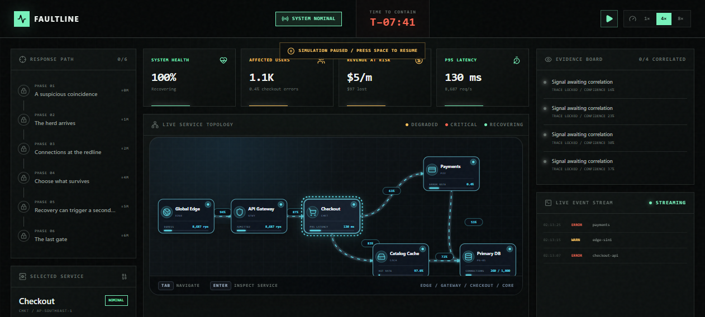
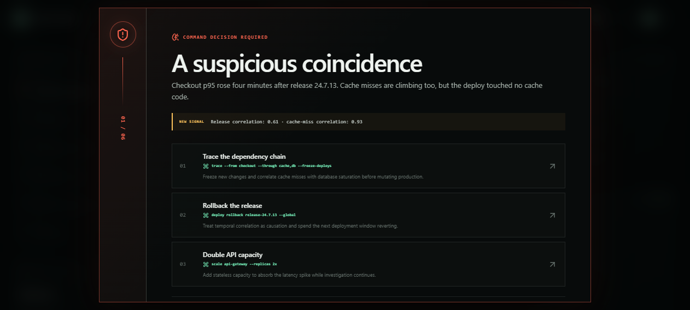
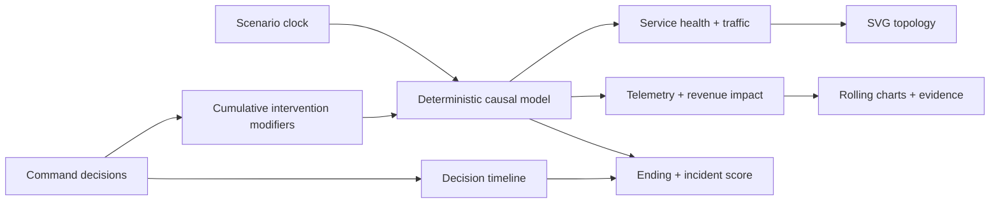
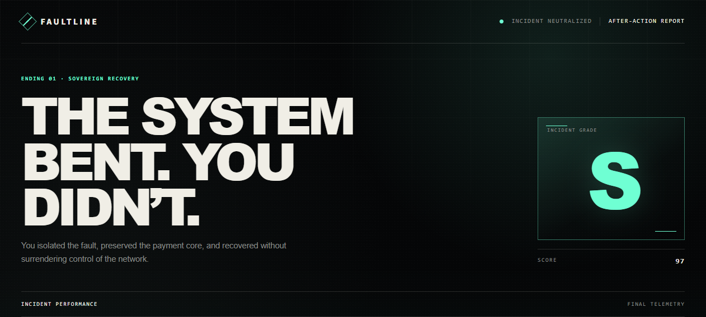

<p align="center">
  <strong>FAULTLINE / INCIDENT COMMANDER</strong><br />
  <em>A cinematic, playable SRE incident simulation.</em>
</p>

<p align="center">
  <a href="https://github.com/junlee122-bot/something/actions/workflows/ci.yml"></a>
  
  
  
</p>



At 02:13 UTC, checkout latency crosses the red line. A global payment path is collapsing from the cache layer into the primary database. You have eight simulated minutes and six irreversible calls to contain it.

FAULTLINE is not a dashboard mockup. It is a complete 2–3 minute interactive incident: briefing, deterministic telemetry, branching interventions, three outcomes, and an exportable after-action report.

## The experience

- **Read the system.** Six services, animated traffic paths, five telemetry modes, live logs, and an evidence board all react to the same causal model.
- **Make the call.** Every decision offers an optimal, mixed, and dangerous intervention. The incident clock pauses, but the consequences do not rewind.
- **Find the real cause.** A recent deploy is deliberate misdirection. The causal chain is synchronized cache expiry → origin stampede → database connection exhaustion.
- **Own the result.** Finish with Sovereign Recovery, Contained Impact, or Systemic Cascade, then compare your timeline with the optimal playbook.



## Why it is portfolio-grade

FAULTLINE combines product storytelling with systems engineering in one self-contained demo:

| Discipline | What is demonstrated |
| --- | --- |
| Product design | A complete beginning, pressure loop, climax, and debrief instead of an endless dashboard |
| Frontend engineering | React state orchestration, deterministic time simulation, responsive SVG, keyboard controls |
| Data visualization | Animated service topology, rolling multi-metric telemetry, evidence correlation |
| Systems thinking | Cache stampede, backpressure, pool saturation, graceful degradation, SLO-gated recovery |
| Accessibility | Semantic regions, focus trapping, numeric shortcuts, reduced-motion support, SVG descriptions |
| Delivery | Strict TypeScript, unit and interaction tests, linting, production build, GitHub Actions |

## Simulation architecture



There is no random data and no external API. Equal time and intervention inputs always produce the same frame, which makes the incident replayable and testable.

The outcome score combines final system health, canonical decision accuracy, and decision quality. Client-provided verdicts are never trusted when the report is built.

## Run locally

```bash
npm install
npm run dev
```

Open the local URL printed by Vite. Node.js 22 is recommended (`.nvmrc` is included).

### Controls

| Input | Action |
| --- | --- |
| `Space` | Pause or resume the simulation |
| `1` / `2` / `3` | Execute the matching command during a decision |
| `1×` / `4×` / `8×` | Change simulation speed |
| `Tab`, `Enter`, `Space` | Navigate and inspect service nodes |

## Quality gates

```bash
npm test       # deterministic model + React interaction coverage
npm run lint   # oxlint static analysis
npm run build  # strict TypeScript + production Vite bundle
```

The repository's `Verify` workflow runs all three on every push and pull request.

## Project map

```text
src/
├── components/            cinematic screens, command UI, SVG visualizations
├── game/
│   ├── scenario.ts        six decision points and eighteen interventions
│   ├── simulation.ts      causal model, service state, scoring, endings
│   └── simulation.test.ts model invariants and all outcome paths
├── App.tsx                experience state machine and simulation clock
└── types.ts               shared domain contracts
```

## Scenario note

All companies, infrastructure, traffic, revenue, and incident data in FAULTLINE are synthetic. The simulator teaches incident-response tradeoffs; it is not an operational runbook for a real production system.


