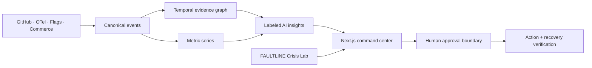

# THREADLINE

> **Every signal, traced to source.**

Threadline now includes the original **FAULTLINE — Incident Commander** as **Crisis Lab**. The operational product explains what happened in a real incident; the training twin lets a user command a separate cache-stampede scenario, see each intervention change the live system model, and receive a scored after-action review.

Threadline is an evidence-native software intelligence command center. It connects intent, code, deployments, runtime telemetry, and customer impact into one time-aware causal thread—then puts human approval and recovery verification around AI-proposed actions.

[](https://github.com/junlee122-bot/something/actions/workflows/ci.yml)
[](https://nextjs.org/)
[](https://www.typescriptlang.org/)
[](https://www.w3.org/WAI/standards-guidelines/wcag/)

This repository is a portfolio-scale concept product. It runs on deterministic demo data, requires no account or API key, and never changes a real production system.

## Why this project exists

During an incident, teams already have the facts—but those facts live in a pull request, deployment dashboard, flag audit, trace waterfall, SLO monitor, analytics tool, and chat room. Threadline turns that fragmented evidence into an inspectable operating picture.

The product deliberately avoids the “chatbot on top of a dashboard” pattern:

- AI claims are labeled as **observed**, **inferred**, or **proposed**.
- Every conclusion links back to evidence, freshness, and conflicting signals.
- The system can be replayed, so the interface shows what was knowable at each moment.
- Agent actions expose the target, blast radius, rollback plan, approver, and success criteria.
- Recovery is not declared until a verification window passes.

## The demo story

The Meridian Market demo follows one incident across every screen:

```text
PR #1842
   → checkout-api@2.18.0 deploy
   → instant-tax-v2 rollout to 100%
   → tax-adapter pool saturation
   → p95 latency +171% / error rate 4.9%
   → checkout conversion −7.3%
   → human-approved flag rollback
   → five-minute recovery verification
```

Open `/incidents/inc-2471` and use the replay controls to watch the graph, metrics, timeline, evidence, and proposed action advance together.

The command and incident surfaces begin at the investigating snapshot so the interaction can be replayed; Agents and Reports preserve the verified 09:40 outcome of that same thread.

### The Crisis Lab story

Open `/lab` to run FAULTLINE scenario 047: an eight-minute cache-stampede incident with six decision gates, 18 production actions, three endings, live topology and telemetry, keyboard controls, and a downloadable after-action report. The model is deterministic, so equal decisions always produce equal outcomes.

## Product surfaces

| Route | Experience |
| --- | --- |
| `/` | Cinematic product narrative and live causal-thread preview |
| `/command` | Evidence-backed briefing, pulse metrics, causal graph, attention queue |
| `/incidents` | Active and historical incident operating view |
| `/incidents/inc-2471` | Time replay, synchronized telemetry, evidence inspector, safe mitigation |
| `/lab` | FAULTLINE crisis simulation, six command gates, live system model, scored debrief |
| `/map` | Interactive service topology with health/change/ownership modes |
| `/changes` | Searchable, explainable change-risk intelligence |
| `/agents` | Agent mission control with inspectable steps and approvals |
| `/reports` | DORA, SLO, customer impact, and weekly reliability narrative |
| `/offline` | PWA fallback with useful navigation |
| `/api/health` | Minimal deployment health endpoint |

Global `⌘/Ctrl K` opens a command palette from every product route.

## Engineering highlights

- Next.js 16 App Router and React 19
- Server Components by default; focused Client Component islands for replay, graph selection, filters, and dialogs
- TypeScript strict mode with a typed domain model and deterministic fixtures
- Deterministic incident simulation engine with bounded interventions, causal dynamics, canonical scoring, and three endings
- Tailwind CSS v4 with a custom token system and Geist typography
- Accessible SVG/data visualization with timeline and table alternatives
- Native dialog semantics for command and approval flows
- Installable PWA metadata and conservative offline service worker
- Security headers for browser capability isolation and service-worker delivery
- Vitest data and utility invariants
- GitHub Actions checks for lint, typecheck, tests, and production build

## Local development

Requirements:

- Node.js 24 or newer
- npm 11 or newer

```bash
git clone https://github.com/junlee122-bot/something.git
cd something
npm install
npm run dev
```

Open [http://localhost:3000](http://localhost:3000).

No `.env` file is required. Set `NEXT_PUBLIC_SITE_URL` only when deploying so canonical metadata, robots, and sitemap URLs use the production origin.

## Quality commands

```bash
npm run lint        # Next/React lint rules
npm run typecheck   # TypeScript, no emit
npm run test        # deterministic unit/invariant tests
npm run build       # production build and route generation
npm run check       # all of the above
```

## Architecture



The shipped demo replaces the ingestion layer with fixed, typed data so the full user journey is reproducible. A production evolution would preserve source events in an append-only log and store generated insights separately.

Read the deeper documents:

- [Architecture](docs/ARCHITECTURE.md)
- [Product brief](docs/PRODUCT.md)
- [Design system](docs/DESIGN_SYSTEM.md)
- [Research references](docs/REFERENCES.md)
- [Contributing](CONTRIBUTING.md)
- [Security](SECURITY.md)

## Accessibility

Threadline targets WCAG 2.2 AA:

- semantic landmarks and a skip link;
- visible keyboard focus and minimum control sizes;
- state labels that do not depend on color;
- reduced-motion behavior;
- native dialog focus management;
- accessible names for charts and metric controls;
- graph information available as a timeline and evidence table;
- responsive completion of the incident-review flow down to 320 CSS px.

## Research lineage

The information architecture draws from primary-source research across Linear, GitHub, Vercel, Sentry, Datadog, Graphite, and Sourcegraph, plus W3C, OpenTelemetry, and DORA guidance. Threadline does not copy a single product's visual identity: it combines provenance, progressive disclosure, keyboard navigation, topology, and human-supervised agent patterns into its own evidence-thread model.

See [docs/REFERENCES.md](docs/REFERENCES.md) for exact sources and the design decisions informed by each.

## License

MIT © 2026 Jun Lee. See [LICENSE](LICENSE).
